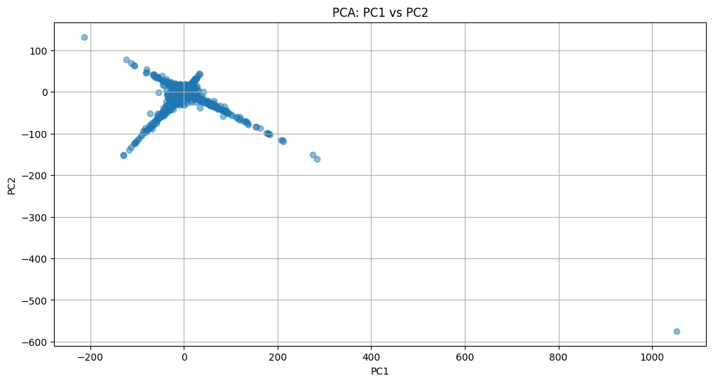

# XMM-Newton X-ray Source Analysis

A data science analysis of the **4XMM-DR14** X-ray source catalog from the XMM-Newton space observatory, featuring original dimensionality reduction technique and astronomical data preprocessing.

## 🌌 Overview

This repository contains a complete analysis pipeline for exploring X-ray source data from the **XMM-Newton** space telescope's **4th XMM-Newton Serendipitous Source Catalog (4XMM-DR14)**. The project demonstrates the application of data science methodologies to astronomical datasets, with particular emphasis on discovering hidden patterns in X-ray source properties.

### Key Features

- **Comprehensive Data Preprocessing**: Quality filtering, outlier removal, and feature engineering
- **Innovative PCA² Analysis**: Double Principal Component Analysis
- **Astronomical Data Handling**: Proper treatment of X-ray flux measurements, hardness ratios, and temporal data
- **Pattern Discovery**: Identification of distinct source populations and unusual objects

## 📊 Dataset

**Source**: ESA's XMM-Newton Science Archive  
**Catalog**: 4XMM-DR14 (4th XMM-Newton Serendipitous Source Catalog, Data Release 14)  
**Format**: Slim version containing key measurements for unique X-ray sources  
**Size**: ~540,000 X-ray sources (after preprocessing: ~280,000 high-quality sources)

### Key Measurements

- **Multi-band X-ray fluxes** (0.2-12.0 keV in various energy bands)
- **Hardness ratios** (spectral hardness indicators HR1-HR4)  
- **Variability parameters** (temporal variability measurements)
- **Source properties** (spatial extent, detection quality, coordinates)
- **Temporal information** (observation dates, detection counts)

## 🗂️ Repository Structure

```
├── README.md                           # This file
├── requirements.txt                    # Python dependencies
├── columns_description.md              # Detailed column descriptions
├── 4xmm_slim_dr14.csv                 # Original raw dataset
├── 4xmm_slim_dr14_preprocessed.csv    # Cleaned dataset
├── preprocessing.ipynb                 # Data cleaning and preprocessing pipeline
├── EDA.ipynb                          # Exploratory Data Analysis
├── PCA^2.ipynb                        # Advanced PCA² analysis
└── env/                               # Python virtual environment
```

## 🛠️ Installation & Setup

### Prerequisites
- Python 3.8+
- Jupyter Notebook/Lab

### Installation

1. **Clone the repository**:
   ```bash
   git clone https://github.com/Ishikawa7/XMM-Newton-Analysis.git
   cd XMM-Newton-Analysis
   ```

2. **Create virtual environment**:
   ```bash
   python -m venv env
   source env/bin/activate  # On Windows: env\Scripts\activate
   ```

3. **Install dependencies**:
   ```bash
   pip install -r requirements.txt
   ```

4. **Launch Jupyter**:
   ```bash
   jupyter notebook
   ```

### Dependencies

- **pandas** (≥1.3.0): Data manipulation and analysis
- **matplotlib** (≥3.5.0): Visualization and plotting  
- **scikit-learn** (≥0.24.0): Machine learning and PCA
- **astropy** (≥5.0.0): Astronomical data handling and time conversions

## 📈 Analysis Pipeline

### 1. Data Preprocessing (`preprocessing.ipynb`)

**Objective**: Transform raw catalog data into a clean, analysis-ready dataset.

**Key Steps**:
- ✅ **Quality Filtering**: Remove sources with poor detection flags (`sc_sum_flag ≠ 0`)
- ✅ **Missing Data Handling**: Strategic approach to NaN values (removal vs. imputation)
- ✅ **Hardness Ratio Quality Control**: Ensure complete spectral information
- ✅ **Outlier Removal**: Modified IQR method for error measurements (98th percentile filtering)
- ✅ **Feature Engineering**: Convert MJD timestamps to datetime format
- ✅ **Data Optimization**: Remove uninformative columns and optimize data types

**Outcome**: High-quality dataset with ~280,000 sources containing complete measurements.

### 2. (Simple) Exploratory Data Analysis (`EDA.ipynb`)

**Objective**: Understand data distributions, correlations, and basic patterns.

**Analysis Components**:
- Distribution analysis of X-ray fluxes and hardness ratios
- Correlation analysis between spectral measurements
- Temporal distribution of observations
- Spatial distribution across the sky
- Variability analysis

### 3. Advanced Pattern Discovery (`PCA^2.ipynb`)

**Objective**: Apply innovative PCA² technique to uncover hidden structure in X-ray source data.

#### **The PCA² Innovation**

**PCA²** (PCA-Squared) is a novel two-stage dimensionality reduction technique:

1. **Stage 1**: Standard PCA on original features → captures main population trends
2. **Stage 2**: PCA on reconstruction errors → reveals unique characteristics and anomalies

**Why This Works**:
- **Reconstruction errors** contain information that standard PCA cannot capture
- These errors represent the "uniqueness" of each source
- Applying PCA to errors reveals systematic patterns in what makes sources unusual

#### **Key Discovery: The Cross Pattern**

The most remarkable finding is a **distinctive cross-shaped structure** in the reconstruction error PCA space:

- **Central Region**: "Typical" sources well-represented by standard PCA
- **Four Arms**: Distinct modes of deviation from typical behavior
- **High Concentration**: ~90% of "uniqueness variance" captured in just 2 dimensions
- **Systematic Structure**: Clear evidence of four different types of anomalous sources



*Figure: Visualization of the cross-shaped structure discovered in the PCA² reconstruction error space. Each point represents an X-ray source. The central region contains typical sources, while the four arms highlight distinct anomaly patterns.*

## 🎯 Key Results & Findings

### 1. Data Quality Assessment
- **~65% data retention** after quality filtering (692k → 448k sources)
- **Complete spectral information** for all retained sources
- **Robust error measurements** after outlier removal

### 2. Population Structure Discovery
- **Four distinct anomaly patterns** revealed by PCA² analysis
- **Systematic deviations** from main population trends
- **Potential subpopulations** with unique astrophysical properties

### 3. Anomaly Detection Capability
- **Clear separation** between typical and unusual sources
- **Quantitative outlier scores** based on reconstruction errors
- **Prime candidates** for detailed astrophysical follow-up

## ⚠️ **Important Limitations & Disclaimers**

### **🚨 CRITICAL: Limited Domain Knowledge**

**This analysis was conducted with LIMITED ASTRONOMICAL DOMAIN EXPERTISE and should be interpreted with significant caution:**

- **⚠️ Simplified Approach**: Uses only basic PCA techniques without incorporating astrophysical priors
- **⚠️ No Physical Modeling**: Does not account for instrumental effects, selection biases, or physical correlations
- **⚠️ Missing Context**: Lacks proper understanding of X-ray source classifications, evolutionary states, and observational systematics
- **⚠️ Statistical Only**: Focuses purely on data patterns without astrophysical interpretation

### **🔬 Technical Limitations**

- **Basic Methodology**: Relies primarily on PCA, a linear technique that may miss complex non-linear relationships
- **No Advanced ML**: Does not employ sophisticated machine learning methods (clustering, neural networks, etc.)
- **Limited Feature Engineering**: Minimal creation of derived astrophysical parameters
- **Preprocessing Choices**: Some decisions (like 98th percentile outlier removal) may be too aggressive for astronomical data

### **📊 Data Limitations**

- **Incomplete Physical Picture**: Uses only tabulated catalog values, not full spectral/timing data
- **Selection Effects**: No correction for XMM-Newton survey selection biases
- **Cross-matching Missing**: No integration with other wavelength catalogs for context
- **Error Propagation**: Simplified treatment of measurement uncertainties

## 🔮 Future Work & Improvements

### **Immediate Next Steps**

1. **🧠 Domain Expert Collaboration**
   - Partner with X-ray astronomers for proper interpretation
   - Validate findings against known source classifications
   - Incorporate astrophysical priors into analysis

2. **🤖 Advanced Machine Learning**
   - Apply clustering algorithms (DBSCAN, HDBSCAN, Gaussian Mixtures)
   - Implement non-linear dimensionality reduction (t-SNE, UMAP)
   - Explore deep learning approaches for pattern recognition

3. **🔗 Enhanced Data Integration**
   - Cross-match with optical catalogs (Gaia, SDSS)
   - Incorporate multiwavelength information
   - Add source classification labels for supervised learning

### **Long-term Research Directions**

4. **🔬 Physical Modeling**
   - Implement proper X-ray spectral fitting
   - Account for instrumental response and systematic errors
   - Develop physically-motivated feature engineering

5. **📈 Advanced Analysis**
   - Time series analysis for variable sources
   - Hierarchical clustering of source populations
   - Anomaly detection with astrophysical context

6. **🎯 Scientific Applications**
   - Systematic search for rare source types
   - Population synthesis modeling
   - Discovery of new X-ray phenomena

## 🤝 Contributing

This project welcomes contributions, especially from:
- **X-ray astronomers** who can provide domain expertise
- **Data scientists** interested in astronomical applications  
- **Students** learning data science with real-world datasets

### How to Contribute
1. Fork the repository
2. Create a feature branch (`git checkout -b feature/improvement`)
3. Commit your changes (`git commit -am 'Add new analysis'`)
4. Push to the branch (`git push origin feature/improvement`)
5. Create a Pull Request

## 📚 References & Acknowledgments

- **XMM-Newton Science Archive**: [https://www.cosmos.esa.int/web/xmm-newton](https://www.cosmos.esa.int/web/xmm-newton)
- **4XMM Catalog**: Webb et al. (2020), A&A, 641, A136
- **ESA XMM-Newton Project**: For making this invaluable dataset publicly available

## 📄 License

This project is licensed under the MIT License - see the [LICENSE](LICENSE) file for details.

---

**⚠️ DISCLAIMER**: This analysis represents a data science exploration of astronomical data with limited domain expertise. Results should not be used for scientific publication without proper astronomical validation and collaboration with X-ray astronomy experts. The techniques demonstrated here are educational and methodological in nature, serving as a starting point for more sophisticated astrophysical analysis.
